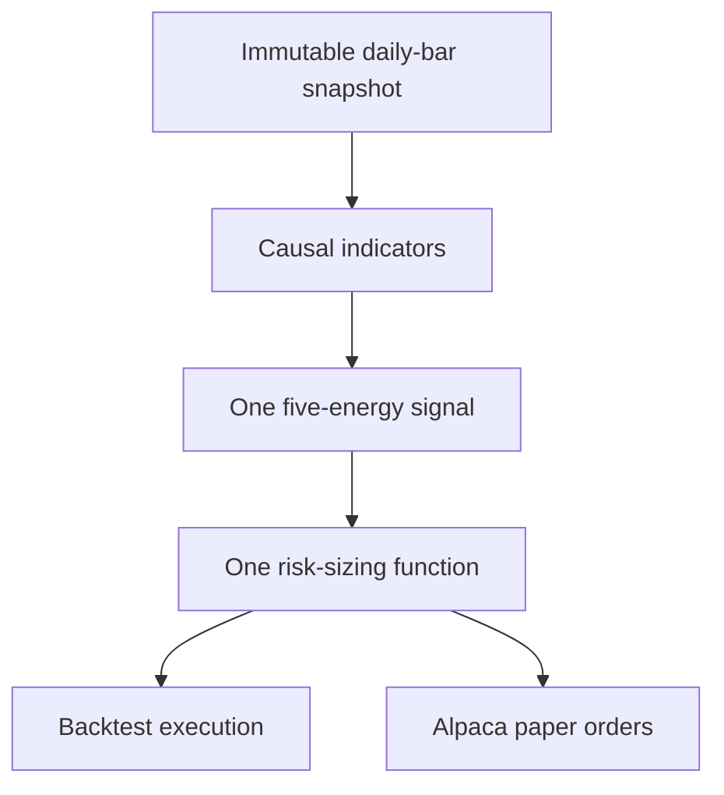

# swingbot research v2

This branch is a clean replacement for the original experiment. It provides a
reproducible long-only ETF backtester and an explicitly gated Alpaca **paper**
trading path. It does not contain a live-trading mode, and it does not claim that
the strategy has an edge.

The rewrite has one rule engine for both research and paper orders:



## What v2 deliberately changes

| Concern | v2 behavior |
|---|---|
| Configuration | One strict TOML file with 11 numeric/risk/data settings; unknown or duplicate settings fail |
| Data | Explicit start/end dates, `adjustment="all"`, recorded feed, immutable CSV files, SHA-256 verification |
| Universe | Fixed liquid US ETFs by default; no present-day constituent lookup |
| Signal timing | Signal uses bar *t* at its close; an order may fill only in the next session |
| Limit fills | Uses only the next session's open/low; its close cannot approve or reject the fill |
| Ambiguous daily bars | If stop and target are both touched, the stop wins |
| Strategy parity | Backtest and paper planning call the same `generate_signal` and `size_order` functions |
| Risk | Per-trade, total open-risk, position-count, notional, cash/buying-power, and duplicate-symbol caps |
| Credentials | `.env` remains local and ignored; paper mode is hard-coded in the Alpaca client |

## Current research hypothesis

Public Top Dog Trading material describes five independent energies—trend,
momentum, cycle, support/resistance, and scale—and describes the 50 SMA, 15 EMA,
slow stochastic, and multiple timeframes. It does not publicly define every rule
needed for a daily ETF algorithm. The exact machine rules and the assumptions are
separated in [the strategy specification](docs/STRATEGY_SPEC.md).

This first baseline requires all five conditions:

1. Price is above a rising 50-day SMA.
2. Daily MACD is above zero.
3. 5-2-3 slow stochastic hooks upward after a pullback.
4. Price tests the 15-day EMA area and closes back above it.
5. The last completed weekly MACD histogram is rising.

MACD, daily/weekly bars, the ETF universe, the exact EMA tolerance, and the fixed
2R exit are research hypotheses—not representations of proprietary course rules.

## Install

Python 3.11 or newer is required.

```bash
python -m venv .venv

# Linux/macOS
. .venv/bin/activate

# PowerShell
# .venv\Scripts\Activate.ps1

python -m pip install -e '.[dev,paper]'
```

Copy `.env.example` to `.env` and insert **paper-account** keys locally. The same
two variable names used by the old project still work:

```dotenv
ALPACA_API_KEY=...
ALPACA_API_SECRET=...
```

Never paste keys into an issue, commit, or pull request.

## Reproducible backtest

First download a date-bounded snapshot. A 500-calendar-day warm-up is fetched
automatically, while the requested test dates remain explicit.

```bash
swingbot fetch \
  --config swingbot.toml \
  --start 2018-01-01 \
  --end 2025-12-31 \
  --snapshot data/snapshots/etf-2018-2025
```

Then run exclusively from that verified snapshot:

```bash
swingbot backtest \
  --config swingbot.toml \
  --snapshot data/snapshots/etf-2018-2025 \
  --start 2018-01-01 \
  --end 2025-12-31 \
  --output reports/etf-2018-2025-v1
```

The report contains `summary.json`, `trades.csv`, `equity.csv`, `signals.csv`,
`orders.csv`, `yearly.csv`, and `by_symbol.csv`. The summary records configuration
and snapshot fingerprints and compares the result with buy-and-hold SPY.

Explain one decision without running a new backtest:

```bash
swingbot explain \
  --config swingbot.toml \
  --snapshot data/snapshots/etf-2018-2025 \
  --symbol SPY \
  --as-of 2024-06-28
```

Alpaca documents that `sip` is consolidated across US exchanges whereas `iex`
contains Investors Exchange data, and that `all` applies split, dividend, and
spin-off adjustments. SIP may require a data subscription. If you must switch to
IEX, change the config *before fetching*; the feed is permanently recorded in the
snapshot. See [Alpaca historical bars](https://docs.alpaca.markets/us/reference/stockbars).

## Paper plan and submission

Evaluate a completed session after the close:

```bash
swingbot paper \
  --config swingbot.toml \
  --as-of 2026-08-07 \
  --plan-out reports/paper-2026-08-07.json
```

That command is a dry run. To submit DAY limit-bracket orders to the Alpaca paper
account, both flags are required:

```bash
swingbot paper \
  --config swingbot.toml \
  --as-of 2026-08-07 \
  --submit \
  --confirm PAPER
```

The adapter reconciles account equity, buying power, positions, open orders, and
visible protective stops first. If reconciliation fails, it submits nothing.
Submission also rejects future, stale, or incomplete as-of dates, refuses the
9:30 AM-4:15 PM New York safety window on weekdays, and verifies through Alpaca's
market clock that the market is closed.
Alpaca's SDK uses `paper=True` for its paper environment, and bracket orders link
the entry, profit target, and protective stop; see the official
[paper-client documentation](https://alpaca.markets/sdks/python/trading.html) and
[order documentation](https://docs.alpaca.markets/us/docs/orders-at-alpaca). The
SDK's [market clock](https://alpaca.markets/sdks/python/api_reference/trading/clock.html)
reports whether the market is currently open.

## Validate locally

```bash
PYTHONPATH=src python -m unittest discover -v
python -m ruff check src tests
python -m compileall -q src tests
```

The suite specifically checks prefix invariance, next-bar lookahead, conservative
same-bar execution, configuration duplication, snapshot tampering, risk caps, and
the hard-coded paper client.

## What I still need from your notes

The code is usable as a research baseline now. To call it *your intended Barry
Burns interpretation*, please add concise notes covering:

- the exact momentum indicator and its parameters;
- the cycle settings and what constitutes a valid hook;
- how the first/second retrace or wave count should be defined;
- which support/resistance levels qualify and how close price must be;
- the higher-timeframe confirmation rule;
- entry, initial stop, partial exit, runner, and cancellation rules.

Do not send course files you are not allowed to share. Your own summary, examples,
and screenshots you have permission to use are enough.

Read [the research protocol](docs/RESEARCH_PROTOCOL.md) before interpreting any
result. Paper fills are simulations and do not establish live performance. This is
research software, not investment advice.
