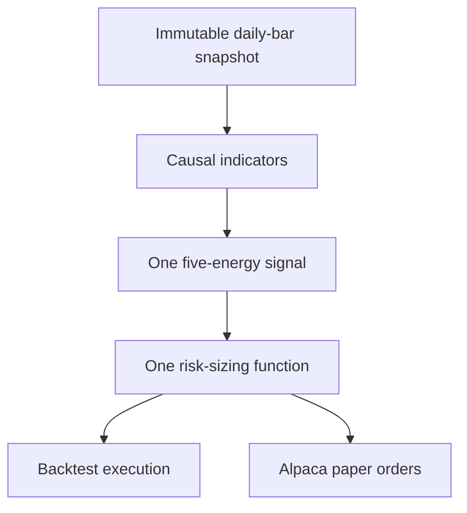

# swingbot research v2

This branch is a clean replacement for the original experiment. It provides a
reproducible long-only ETF backtester and an explicitly gated Alpaca **paper**
trading path. It does not contain a live-trading mode, and it does not claim that
the strategy has an edge.

The rewrite has one rule engine for both research and paper orders:



## What v2 deliberately changes

| Concern | v2 behavior |
|---|---|
| Configuration | One strict TOML file with 11 numeric/risk/data settings; unknown or duplicate settings fail |
| Data | Explicit start/end dates, `adjustment="all"`, recorded feed, immutable CSV files, SHA-256 verification |
| Universe | Fixed liquid US ETFs by default; no present-day constituent lookup |
| Signal timing | Signal uses bar *t* at its close; an order may fill only in the next session |
| Stop-limit fills | Requires the next session to trigger above the hook bar; its close cannot approve or reject the fill |
| Ambiguous daily bars | If stop and target are both touched, the stop wins |
| Strategy parity | Backtest and paper planning call the same `generate_signal` and `size_order` functions |
| Risk | Per-trade, total open-risk, position-count, notional, cash/buying-power, and duplicate-symbol caps |
| Credentials | `.env` remains local and ignored; paper mode is hard-coded in the Alpaca client |

## Current book-derived hypothesis

`burns-book-v1` is an objective daily/weekly, long-only translation of Barry
Burns's *Trend Trading For Dummies*. The exact rules and their page-level basis
are in [the strategy specification](docs/STRATEGY_SPEC.md); the broader audit,
including intentionally deferred material, is in
[the book implementation map](docs/BOOK_IMPLEMENTATION_MAP.md).

The setup scores five energies and needs at least four. Scale is always required;
Trend and Cycle are also required in this translation because they establish the
long direction and entry trigger. Therefore, either Momentum or Support may be
the one missing energy:

1. Trend: close above a rising 50-SMA on the first or second retrace.
2. Momentum: daily MACD line above zero at the active cycle low.
3. Cycle: 5-2-3 stochastic %K hooks up below the midpoint with price/%K
   mini-divergence.
4. Support: the cycle low tests a causal 15-EMA, 50-SMA, or prior cycle level.
5. Scale: the last completed weekly MACD **line** is angled upward.

Entry is a next-session DAY buy stop-limit one tick above the closed hook bar;
the initial hard stop is one tick below the active cycle low. Position size is
capped by risk, capital, portfolio capacity, and 0.1% of 90-session average
volume. The fixed full-position 2R target is a transparent engineering baseline,
not Burns's exit method. His partial-at-cycle-high and cycle-low trailing process
is documented but deferred until order replacement and recovery are fail-closed.

## Install

Python 3.11 or newer is required.

```bash
python -m venv .venv

# Linux/macOS
. .venv/bin/activate

# PowerShell
# .venv\Scripts\Activate.ps1

python -m pip install -e '.[dev,paper]'
```

Copy `.env.example` to `.env` and insert **paper-account** keys locally. The same
two variable names used by the old project still work:

```dotenv
ALPACA_API_KEY=...
ALPACA_API_SECRET=...
```

Never paste keys into an issue, commit, or pull request.

## Reproducible backtest

First download a date-bounded snapshot. A 500-calendar-day warm-up is fetched
automatically, while the requested test dates remain explicit.

```bash
swingbot fetch \
  --config swingbot.toml \
  --start 2018-01-01 \
  --end 2025-12-31 \
  --snapshot data/snapshots/etf-2018-2025
```

Then run exclusively from that verified snapshot:

```bash
swingbot backtest \
  --config swingbot.toml \
  --snapshot data/snapshots/etf-2018-2025 \
  --start 2018-01-01 \
  --end 2025-12-31 \
  --output reports/etf-2018-2025-v1
```

The report contains `summary.json`, `trades.csv`, `equity.csv`, `signals.csv`,
`orders.csv`, `yearly.csv`, and `by_symbol.csv`. The summary records strategy,
configuration, and snapshot fingerprints and compares the result with
buy-and-hold SPY.

### Authenticated GitHub research runs

The protected workflow in `.github/workflows/research-backtest.yml` executes a
strict, committed file under `research/requests/`. It exposes
`ALPACA_API_KEY` and `ALPACA_API_SECRET` only to the fetch/backtest step, uses
read-only repository permissions, pins every action to a full commit SHA, and
accepts at most 25 symbols over ten calendar years. Missing secrets, an unsafe
path, a current-day end date, or any snapshot/config mismatch stops the run.

Because this repository is public, the workflow does **not** publish licensed
raw bars. Its 30-day artifact contains the raw-file hash manifest, a stable data
fingerprint, run/config/strategy fingerprints, and derived reports. The snapshot
itself exists only on the ephemeral GitHub runner. After this workflow is merged
to the default branch, the repository owner can select a committed request with
**Run workflow**.

Explain one decision without running a new backtest:

```bash
swingbot explain \
  --config swingbot.toml \
  --snapshot data/snapshots/etf-2018-2025 \
  --symbol SPY \
  --as-of 2024-06-28
```

Alpaca documents that `sip` is consolidated across US exchanges whereas `iex`
contains Investors Exchange data, and that `all` applies split, dividend, and
spin-off adjustments. SIP may require a data subscription. If you must switch to
IEX, change the config *before fetching*; the feed is permanently recorded in the
snapshot. See [Alpaca historical bars](https://docs.alpaca.markets/us/reference/stockbars).

## Paper plan and submission

Evaluate a completed session after the close:

```bash
swingbot paper \
  --config swingbot.toml \
  --as-of 2026-08-07 \
  --plan-out reports/paper-2026-08-07.json
```

That command is a dry run. To submit DAY stop-limit bracket orders to the Alpaca
paper account, both flags are required:

```bash
swingbot paper \
  --config swingbot.toml \
  --as-of 2026-08-07 \
  --submit \
  --confirm PAPER
```

The adapter reconciles account equity, buying power, positions, open orders, and
visible protective stops first. If reconciliation fails, it submits nothing.
Submission also rejects future, stale, or incomplete as-of dates, refuses the
9:30 AM-4:15 PM New York safety window on weekdays, and verifies through Alpaca's
market clock that the market is closed.
Alpaca's SDK uses `paper=True` for its paper environment, and bracket orders link
the entry, profit target, and protective stop; see the official
[paper-client documentation](https://alpaca.markets/sdks/python/trading.html) and
[order documentation](https://docs.alpaca.markets/us/docs/orders-at-alpaca). The
SDK's [market clock](https://alpaca.markets/sdks/python/api_reference/trading/clock.html)
reports whether the market is currently open.

## Validate locally

```bash
PYTHONPATH=src python -m unittest discover -s tests -v
python -m ruff check src tests
python -m compileall -q src tests
```

The suite specifically checks indicator and signal prefix invariance, book-rule
vetoes, retrace counting, next-bar trigger/limit behavior, conservative same-bar
execution, configuration duplication, snapshot tampering, liquidity/risk caps,
and the hard-coded paper client.

Read [the research protocol](docs/RESEARCH_PROTOCOL.md) before interpreting any
result. Paper fills are simulations and do not establish live performance. This is
research software, not investment advice.
